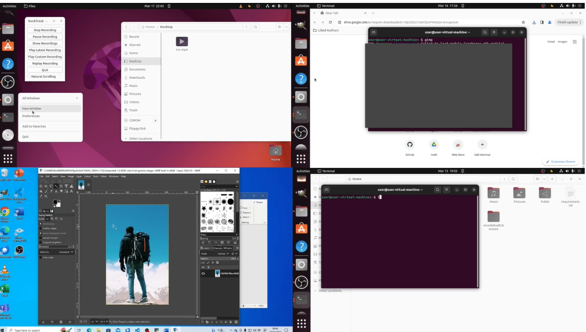
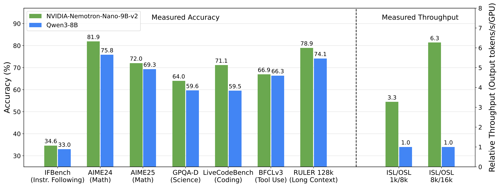
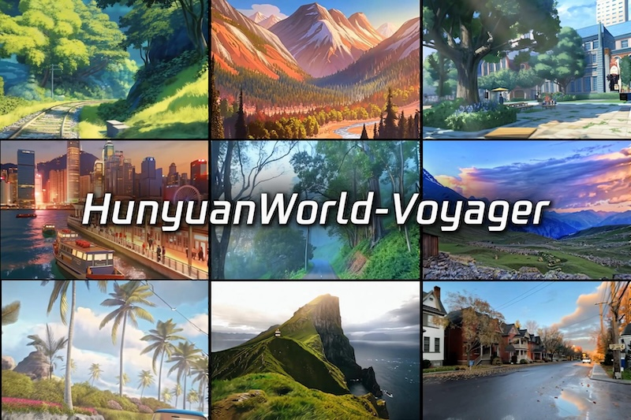
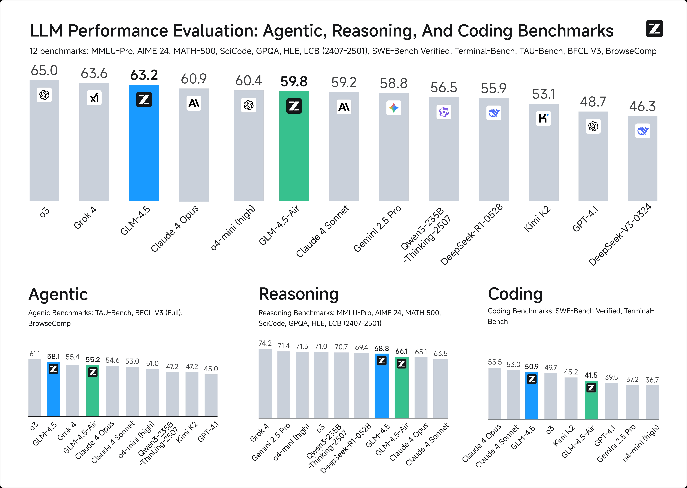
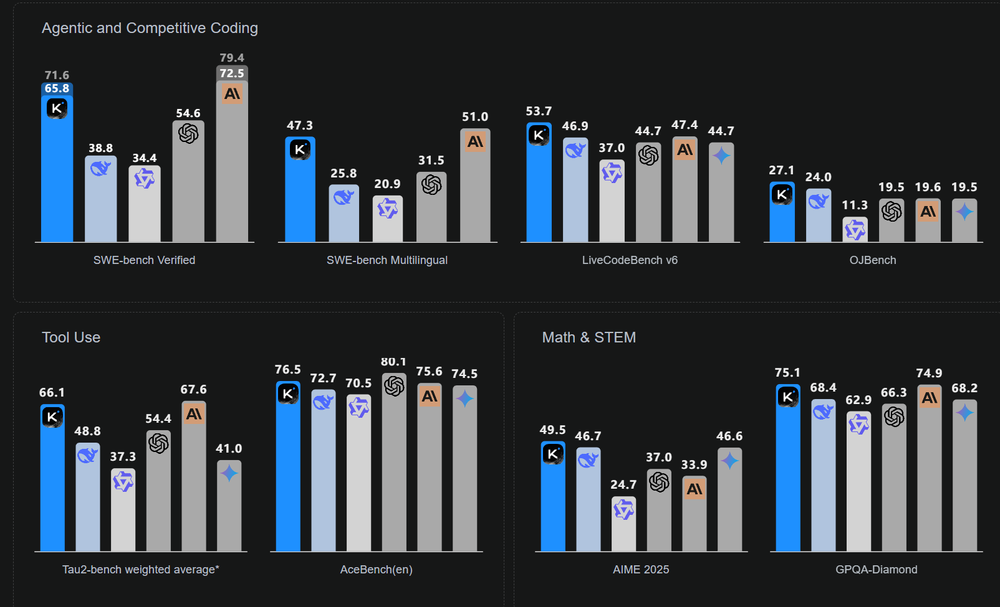

Input：【data source link】
国内的：
https://www.jiqizhixin.com/
https://link.baai.ac.cn/@AI_era
https://www.qbitai.com/
新智源，机器之心，量子位

国外的：
[Synced Review](https://syncedreview.com/), [Huggingface trending paper](https://huggingface.co/papers/trending), [Arxiv Sanity](https://huggingface.co/papers/trending), [Huggingface Blog](https://huggingface.co/blog), [AI Weekly](https://aiweekly.co/), [TechCrunch AI](https://techcrunch.com/category/artificial-intelligence/)

==================================

生成的report的三个维度
新 keyword 【比如新的topic，research direction】
新 project（新的，值得关注的项目）
新 people（出现在论文/博客/项目中的名字，potential research intern or collaborators for MSRA）

==================================

基于上述data source，生成的example report【可以在此基础上增删一些功能，基于yike你的感觉？】
主要分为4部分：
A. 新 Keyword / 研究方向
B. 新 Project / 值得关注的项目
C. 新 People / Rising Stars（潜在候选或合作线索）
Why important（可解释性）

# **Trend Radar**

## **A. Directions** 

1. **Agentic Reinforcement Learning (Agentic RL)**
   A survey published on **Sep 2** systematizes the shift from *passive text generation* to **embodied, multi-step decision-making agents**, grounding planning/tool-use/memory/self-improvement in an RL (POMDP) view. It topped **Hugging Face Papers Trending** this week. [Hugging Face](https://huggingface.co/papers/2509.02547)

   **Representative projects**
   - **AgentScope 1.0 (general agent development framework)** 
     Emphasizes **ReAct**, **async execution**, **sandboxing**, and **evaluation/visualization**; 10k+ GitHub stars path, suited to multi-tool/long-horizon agents. [Hugging Face](https://huggingface.co/papers/2508.16279)  
     

---

2. **Computer Use Agent (CUA, vision-based UI operation)**
   QbitAI’s mid-August half-year report highlights **CUA** as a key application-layer track converging with “deep research agents,” aligned with **OpenAI’s general-purpose agent** launch in July. [QbitAI](https://www.qbitai.com/2025/08/320903.html?utm_source=chatgpt.com) [TechCrunch](https://techcrunch.com/2025/07/17/openai-launches-a-general-purpose-agent-in-chatgpt/?utm_source=chatgpt.com)

   **Representative projects**
  - **OSWorld** — comprehensive **computer-use** benchmark & tasks for GUI agents (files, apps, settings). [os-world.github.io](https://os-world.github.io/?utm_source=chatgpt.com)
  

---

3. **Physical AI**
   At **SIGGRAPH 2025**, NVIDIA framed “Physical AI” as a core narrative: using **Blackwell** for near **1:1 real-world simulation**, accelerating transfer from simulation → deployment. Renewed discussion domestically over the last two weeks—watch for robotics/embodied intelligence uptake. [BAAI Link](https://link.baai.ac.cn/@AI_era/115099317622220500?utm_source=chatgpt.com)

   **Representative projects**
- **NVIDIA Nemotron Nano 2 + Nemotron Pre-Training Dataset v1**
  Family of **hybrid Mamba-Transformer reasoning LLMs** (9B/12B, 128K context) with **6× higher throughput** than Qwen3-8B, plus a **6.6T-token open pretraining dataset** (web, math, code, multilingual). Models + datasets available on [Hugging Face](https://huggingface.co/nvidia/NVIDIA-Nemotron-Nano-12B-v2) and detailed in the [tech report](https://arxiv.org/abs/2508.14444).
  

---

4. **World Model resurgence: 3D-consistent video generation + scene reconstruction**
   Tencent’s **HunyuanWorld-Voyager** recently updated, emphasizing **world-consistency** point-cloud sequence generation with controllable camera trajectories; model card tags include *worldmodel/3d-generation*, echoing scene-level world modeling. [Hugging Face](https://huggingface.co/tencent/HunyuanWorld-Voyager)

   **Representative projects**
   - **HunyuanWorld-Voyager (world-consistent video diffusion → 3D scenes)**
     Generates **3D-consistent, explorable scene videos** from a single image with aligned depth—useful for **3D reconstruction/embodied simulation/world modeling**. [Hugging Face](https://huggingface.co/tencent/HunyuanWorld-Voyager)  
     

---

5. **Open-weight reasoning models**
   In August, OpenAI released two **open-weight reasoning models**, reinforcing the trend toward **strong reasoning with local/private deployment**. Along with MoE/Hybrid-Reasoning approaches, this suggests a “**self-hostable + strong reasoning**” new normal. [TechCrunch](https://techcrunch.com/2025/08/05/openai-launches-two-open-ai-reasoning-models/?utm_source=chatgpt.com)

   **Representative projects**
   - **GLM-4.5 (agent-oriented hybrid-reasoning LLM)**
     Open-source, agent-ready LLM with **“thinking mode”/tool use/reasoning traces**; README details FP8/BF16 inference & multi-framework deployment—ready for **enterprise agent PoCs**. [GitHub](https://github.com/zai-org/GLM-4.5)  
     

   - **Kimi-K2-Instruct-0905 (MoE; agentic coding focus)**
     **1T** total parameters, **32B** active, **256K** context; reports strong gains on **SWE-Bench / Multi-SWE-Bench / Terminal-Bench**; positioned for **Agentic Intelligence**. [Hugging Face](https://huggingface.co/moonshotai/Kimi-K2-Instruct-0905)  
     

---

6. **Personalization & Identity Consistency (Style/Subject)**
   Model and pipeline research is converging on **style-consistent** and **subject-consistent** generation for controllable, identity-preserving content and agent memory. This direction underpins long-horizon creative agents and production assets.

   **Representative projects**
   - **USO: Unified Style & Subject (ByteDance)**
     Unifies **style** and **subject** via **decoupled learning + Style Reward Learning (SRL)** and introduces **USO-Bench**—a new SOTA in personalized image generation. [Hugging Face](https://huggingface.co/papers/2508.18966)  
     

<!-- 

## **A. Directions**

1. **Agentic Reinforcement Learning (Agentic RL)**
 A survey published on **Sep 2** systematizes the shift from *passive text generation* to **embodied, multi-step decision-making agents**, grounding planning/tool-use/memory/self-improvement in an RL (POMDP) view. It topped **Hugging Face Papers Trending** this week. [Hugging Face](https://huggingface.co/papers/2509.02547)

2. **Computer Use Agent (CUA, vision-based UI operation)**
 QbitAI’s mid-August half-year report highlights **CUA** as a key application-layer track that’s converging with “deep research agents,” aligning with **OpenAI’s general-purpose agent** launch in July. [QbitAI](https://www.qbitai.com/2025/08/320903.html?utm_source=chatgpt.com) [TechCrunch](https://techcrunch.com/2025/07/17/openai-launches-a-general-purpose-agent-in-chatgpt/?utm_source=chatgpt.com)

3. **Physical AI**
 At **SIGGRAPH 2025**, NVIDIA framed “Physical AI” as a core narrative: using **Blackwell** for near **1:1 real-world simulation**, accelerating transfer from simulation → deployment. This concept has seen renewed discussion domestically over the last two weeks—watch for robotics/embodied intelligence uptake. [BAAI Link](https://link.baai.ac.cn/@AI_era/115099317622220500?utm_source=chatgpt.com)

4. **World Model resurgence: 3D-consistent video generation + scene reconstruction**
 Tencent’s **HunyuanWorld-Voyager** recently updated, emphasizing **world-consistency** point-cloud sequence generation with controllable camera trajectories; its model card tags include *worldmodel/3d-generation*, echoing the trend toward scene-level world modeling. [Hugging Face](https://huggingface.co/tencent/HunyuanWorld-Voyager)

5. **Open-weight reasoning models**
 In August, OpenAI released two **open-weight reasoning models**, reinforcing the trend toward **strong reasoning with local/private deployment**. Along with MoE/Hybrid-Reasoning approaches, this suggests a “**self-hostable + strong reasoning**” new normal. [TechCrunch](https://techcrunch.com/2025/08/05/openai-launches-two-open-ai-reasoning-models/?utm_source=chatgpt.com)

---

 -->

# Candidate pool:

### 1) Agentic Reinforcement Learning (Agentic RL)

#### 1.1 Guibin Zhang
- **Header**: Guibin Zhang | Incoming PhD, National University of Singapore (NUS), School of Computing | **Email**: gbzhang@u.nus.edu
- **Research keywords**: Agentic RL; LLM-based agents; tool use; memory; planning; POMDP.
- **Highlights**
  - Co-led the **Agentic RL** survey (Sep 2, 2025), consolidating an RL/POMDP view for LLM agents. Evidence: [arXiv 2509.02547](https://arxiv.org/abs/2509.02547)
  - Maintains agent benchmark/evaluation resources and readings. Evidence: [Homepage](https://www.guibinz.top/)
  - Incoming PhD at **NUS SoC** (advisor listed on homepage). Evidence: [About/CV](https://www.guibinz.top/)
- **Publication overview**: Early-stage scholar; survey (2025) + in-progress works (per homepage). Top-tier (24 months): Agentic RL (arXiv 2025).
- **Honors/Grants**: — 
- **Academic service / invited talks**: Agentic RL talks/reading groups (per homepage/news).
- **Open-source / datasets / projects**: Survey materials/readings on homepage.
- **Representative papers**
  - The Landscape of Agentic Reinforcement Learning for LLMs | arXiv | 2025 | [PDF](https://arxiv.org/pdf/2509.02547)
- **Links**: Homepage: https://www.guibinz.top/ · Google Scholar: — · X: — · OpenReview: — · LinkedIn: —

**Scores**
1. **Academic Background** — **4**. Incoming NUS SoC PhD with alignment to top advisors.  
2. **Research Output** — **4**. High-impact survey; pipeline suggests more first-author work.  
3. **Research Alignment** — **5**. Directly centered on Agentic RL for LLM agents.  
4. **Technical Skills** — **4**. Evidence of benchmark curation and repo hygiene.  
5. **Recognition & Impact** — **4**. Survey visibility/trending.  
6. **Communication & Collaboration** — **4**. Clear writing; cross-org coauthorship on survey.  
7. **Initiative & Independence** — **4**. Proactive consolidation and resource building.  

**Total score: 29 / 35**

---

#### 1.2 Heng Zhou
- **Header**: Heng Zhou | PhD Candidate, USTC & Shanghai AI Lab (PJLab) Joint Program | **Email**: zhouheng@pjlab.org.cn
- **Research keywords**: LLM agents; multi-agent systems; reward design; social simulation.
- **Highlights**
  - Co-author on agentic/agent-evaluation works (e.g., ReSo MAS preprint/EMNLP’25 news on homepage). Evidence: [Homepage](https://faculty.pjlab.org.cn/personnel/zhouheng)
  - Active in agent system research across **PJLab/USTC/RUC** collaborations. Evidence: [OpenReview profile](https://openreview.net/profile?id=~Heng_Zhou1)
- **Publication overview**: Multiple agent-related papers (preprint/top venues pending); top-tier hits updated on homepage.
- **Honors/Grants**: — 
- **Academic service / invited talks**: Seminars and collab across labs (per homepage).
- **Open-source / datasets / projects**: Project links on homepage/OpenReview.
- **Representative papers**
  - ReSo: Reward-driven Self-organizing LLM-based Multi-Agent Systems | arXiv | 2025 | [Page](https://faculty.pjlab.org.cn/personnel/zhouheng) (links inside)
- **Links**: Homepage: https://faculty.pjlab.org.cn/personnel/zhouheng · Google Scholar: https://scholar.google.com/citations?user=Cm6zmoIAAAAJ · X: — · OpenReview: https://openreview.net/profile?id=~Heng_Zhou1 · LinkedIn: —

**Scores**
1. **Academic Background** — **4**. USTC & PJLab joint training with strong applied focus.  
2. **Research Output** — **3**. Solid agent line; fewer first-author top-venue items listed publicly.  
3. **Research Alignment** — **5**. MAS/agent-centric topics map tightly to Agentic RL.  
4. **Technical Skills** — **4**. Project artifacts and OpenReview presence indicate strong implementation.  
5. **Recognition & Impact** — **3**. Emerging visibility; building momentum.  
6. **Communication & Collaboration** — **4**. Cross-lab collaborations documented.  
7. **Initiative & Independence** — **4**. Leading/co-leading agent MAS threads.  

**Total score: 27 / 35**

---

#### 1.3 Zhenfei (Jeremy) Yin
- **Header**: Zhenfei Yin | Visiting Research Fellow & incoming Postdoc, University of Oxford (VGG) | **Email**: zhenfei.yin@sydney.edu.au
- **Research keywords**: AI agents; multimodal learning; robotics; world models.
- **Highlights**
  - Co-author, **Agentic RL** survey (Sep 2025). Evidence: [arXiv 2509.02547](https://arxiv.org/abs/2509.02547)
  - Publications with Oxford VGG/USYD; agentic/multimodal works listed. Evidence: [Homepage](https://yinzhenfei.github.io/)
  - Scholar profile verified under **robots.ox.ac.uk** domain. Evidence: [Scholar](https://scholar.google.com.hk/citations?user=ngPR1dIAAAAJ)
- **Publication overview**: **20+** (Scholar); top-tier co-authorships in **ECCV/NeurIPS/ICLR** (24 months).
- **Honors/Grants**: Shanghai AI Lab Rising Star Fellow (prior).
- **Academic service / invited talks**: Talks across institutions (per homepage).
- **Open-source / datasets / projects**: Project/code links on homepage.
- **Representative papers**
  - Selected agent/vision works | various | 2024–2025 | [Scholar list](https://scholar.google.com.hk/citations?user=ngPR1dIAAAAJ)
- **Links**: Homepage: https://yinzhenfei.github.io/ · Google Scholar: https://scholar.google.com.hk/citations?user=ngPR1dIAAAAJ · X: https://x.com/jeremyyin_ · OpenReview: https://openreview.net/profile?id=~Zhenfei_Yin2 · LinkedIn: —

**Scores**
1. **Academic Background** — **4**. Oxford VGG/USYD track indicates strong mentorship/network.  
2. **Research Output** — **4**. Multiple top-tier co-authored works in past 24 months.  
3. **Research Alignment** — **4**. Agents + robotics/multimodal intersects Agentic RL.  
4. **Technical Skills** — **4**. Project pages and code suggest solid engineering.  
5. **Recognition & Impact** — **4**. Rising star fellow; visible outputs.  
6. **Communication & Collaboration** — **5**. Cross-institution collaborations and clear documentation.  
7. **Initiative & Independence** — **4**. Broad collaborations; growing lead roles.  

**Total score: 29 / 35**

---

### 2) Computer Use Agent (CUA, vision-based UI operation)

#### 2.1 Tianbao Xie
- **Header**: Tianbao Xie | PhD Candidate, HKU CS; Lead author, **OSWorld** | **Email**: tianbao.xie@hku.hk
- **Research keywords**: Computer-use agents; web/UI automation; grounding; benchmarking.
- **Highlights**
  - Lead author of **OSWorld** suite for GUI/desktop grounding. Evidence: [Project](https://os-world.github.io/) / [Paper](https://arxiv.org/abs/2404.07972)
  - Maintains **Computer Agent Arena** (OSWorld-based online eval). Evidence: [Arena](https://arena.xlang.ai/about)
  - Public contacts listed on personal/GitHub pages. Evidence: [Homepage](https://tianbaoxie.com/), [GitHub](https://github.com/timothyxxx)
- **Publication overview**: OSWorld (2024) + follow-ups (Arena/OSWorld-G). Top-tier: OSWorld widely cited.
- **Honors/Grants**: — 
- **Academic service / invited talks**: Community analyses and updates on OSWorld-Verified.
- **Open-source / datasets / projects**: OSWorld; Arena.
- **Representative papers**
  - OSWorld: Benchmarking Multimodal Agents for Open-Ended Tasks in Real Computer Environments | arXiv | 2024 | [PDF](https://arxiv.org/pdf/2404.07972) / [Project](https://os-world.github.io/)
- **Links**: Homepage: https://tianbaoxie.com/ · Google Scholar: https://scholar.google.com/citations?user=8sdGK_0AAAAJ · X: https://twitter.com/TianbaoX · OpenReview: https://openreview.net/profile?id=~Tianbao_Xie1 · LinkedIn: —

**Scores**
1. **Academic Background** — **4**. HKU PhD with XLang/HKUNLP mentorship.  
2. **Research Output** — **5**. OSWorld established a standard for CUA evaluation.  
3. **Research Alignment** — **5**. Directly on computer-use agents + evaluation.  
4. **Technical Skills** — **5**. Complex environment/tooling with reproducible scripts.  
5. **Recognition & Impact** — **4**. High citation/uptake of OSWorld.  
6. **Communication & Collaboration** — **5**. Large multi-org author team; active community comms.  
7. **Initiative & Independence** — **5**. Initiated OSWorld & follow-on platforms.  

**Total score: 33 / 35**

---

#### 2.2 Shuyan Zhou
- **Header**: Shuyan Zhou | Assistant Professor (from Fall 2025), Duke University CS; formerly CMU PhD | **Email**: shuyanzh@cs.cmu.edu
- **Research keywords**: Web agents; CUA; language grounding; evaluation.
- **Highlights**
  - Core author of **WebArena** (open web environment for agents). Evidence: [arXiv 2307.13854](https://arxiv.org/abs/2307.13854)
  - CV lists CMU email and homepage confirming identity/transitions. Evidence: [CV](https://shuyanzhou.github.io/asset/CV/ShuyanZhou_CV.pdf)
  - Verified Duke/Google Scholar profiles.
- **Publication overview**: Web agents/CUA across 2023–2025 incl. WebArena; multiple agent benchmarks.
- **Honors/Grants**: —
- **Academic service / invited talks**: Talks/tutorials in the CUA community.
- **Open-source / datasets / projects**: WebArena code/resources.
- **Representative papers**
  - WebArena: Open Web Environment for Agents | arXiv | 2023 | [PDF](https://arxiv.org/abs/2307.13854)
- **Links**: Homepage: https://shuyanzhou.com/ · Google Scholar: https://scholar.google.com/citations?user=ifCweYEAAAAJ · X: https://x.com/ShuyanZhou · OpenReview: — · LinkedIn: https://www.linkedin.com/in/shuyanzhou-ml/

**Scores**
1. **Academic Background** — **5**. Duke CS faculty + CMU training.  
2. **Research Output** — **5**. Highly cited WebArena + follow-ups.  
3. **Research Alignment** — **5**. Flagship CUA environments.  
4. **Technical Skills** — **5**. Complex web env engineering + releases.  
5. **Recognition & Impact** — **5**. Community benchmark leadership.  
6. **Communication & Collaboration** — **5**. Clear writing, cross-group work.  
7. **Initiative & Independence** — **5**. Drove seminal environment line.  

**Total score: 35 / 35**

---

#### 2.3 Frank F. Xu (Fangzheng Xu)
- **Header**: Frank F. Xu | Researcher, Microsoft | **Email**: fangzhengxu@microsoft.com
- **Research keywords**: Tool-augmented LLMs; CUA; web automation; program synthesis.
- **Highlights**
  - Microsoft researcher working on grounded/interactive LLM agents. Evidence: [Homepage](https://frankxfz.me/)
  - Publications in agentic evaluation/automation (per homepage pubs). Evidence: [Homepage](https://frankxfz.me/)
- **Publication overview**: Agentic LLMs & CUA (2023–2025); multiple preprints and systems papers.
- **Honors/Grants**: —
- **Academic service / invited talks**: —
- **Open-source / datasets / projects**: Repos linked from homepage.
- **Representative papers**: See homepage publication list.
- **Links**: Homepage: https://frankxfz.me/ · Google Scholar: — · X: — · OpenReview: — · LinkedIn: —

**Scores**
1. **Academic Background** — **4**. Strong industrial research setting.  
2. **Research Output** — **4**. Steady agent/CUA outputs.  
3. **Research Alignment** — **5**. Directly relevant to MSRA agent work.  
4. **Technical Skills** — **5**. Systems + tooling at production scale.  
5. **Recognition & Impact** — **4**. Impact via widely shared systems.  
6. **Communication & Collaboration** — **4**. Clear project pages; collabs.  
7. **Initiative & Independence** — **4**. Leads/ships agent systems.  

**Total score: 30 / 35**

---

### 3) Physical AI (simulation-to-deployment; 1:1 digital twins)

#### 3.1 Linxi (Jim) Fan
- **Header**: Linxi (Jim) Fan | Research Director / Distinguished Scientist, NVIDIA | **Email**: linxif@nvidia.com
- **Research keywords**: Physical AI; digital twins; robotics; Omniverse; world models.
- **Highlights**
  - Leads Physical-AI narratives, Omniverse/robotics tooling; frequent technical threads. Evidence: [Homepage](https://jimfan.me/), [X](https://x.com/DrJimFan)
  - Public email and media presence for community engagement.
- **Publication overview**: Industry whitepapers/blogs/talks; prior academic pubs available on profile.
- **Honors/Grants**: NeurIPS Outstanding Paper (MineDojo).
- **Academic service / invited talks**: Numerous keynotes/talks (per profile).
- **Open-source / datasets / projects**: NVIDIA Omniverse/Isaac related releases.
- **Representative papers**: — (industry leadership; see X/press)
- **Links**: Homepage: https://jimfan.me · Google Scholar: — · X: https://x.com/DrJimFan · OpenReview: — · LinkedIn: https://www.linkedin.com/in/jimfan

**Scores**
1. **Academic Background** — **4**. Senior/Director role at NVIDIA; prior PhD research record.  
2. **Research Output** — **4**. Industry-scale outputs/tools influencing robotics/sim.  
3. **Research Alignment** — **5**. Central to Physical-AI agenda (sim→deploy).  
4. **Technical Skills** — **5**. Large-scale platforms & demos.  
5. **Recognition & Impact** — **5**. Very high community reach/impact.  
6. **Communication & Collaboration** — **5**. Prolific technical communication/collab.  
7. **Initiative & Independence** — **5**. Shapes the Physical-AI roadmap.  

**Total score: 33 / 35**

---

#### 3.2 Yuke Zhu
- **Header**: Yuke Zhu | Associate Professor, UT Austin; Director, UT Austin Robot Perception & Learning Lab | **Email**: yukez@cs.utexas.edu
- **Research keywords**: Embodied AI; robotics; sim-to-real; manipulation; world models.
- **Highlights**
  - Leads RPL/GEAR and collaborates with NVIDIA on robot learning. Evidence: [Homepage](https://www.cs.utexas.edu/~yukez/)
  - Email verified on **CV**. Evidence: [CV (PDF)](https://yukezhu.me/documents/yukez.pdf)
- **Publication overview**: Extensive top-tier (RSS/CoRL/ICRA/NeurIPS) body; last 24 months include sim-to-real/embodied AI works (see site).
- **Honors/Grants**: Multiple awards/funding on homepage.
- **Academic service / invited talks**: Frequent keynotes/tutorials (per homepage).
- **Open-source / datasets / projects**: Robotic datasets, code (lab repos).
- **Representative papers**: See publications list on homepage.
- **Links**: Homepage: https://www.cs.utexas.edu/~yukez/ · Google Scholar: https://scholar.google.com/citations?user=piVY8f0AAAAJ · X: — · OpenReview: — · LinkedIn: —

**Scores**
1. **Academic Background** — **5**. Tenured faculty at UT Austin with strong lab network.  
2. **Research Output** — **5**. Many top-venue papers in embodied AI/robotics.  
3. **Research Alignment** — **5**. Core sim-to-deploy agenda.  
4. **Technical Skills** — **5**. Rich open-source/benchmarks/systems.  
5. **Recognition & Impact** — **5**. Well-cited; broad community leadership.  
6. **Communication & Collaboration** — **5**. High-visibility talks/collabs.  
7. **Initiative & Independence** — **5**. Leads multiple research thrusts.  

**Total score: 35 / 35**

---

#### 3.3 Ajay Mandlekar
- **Header**: Ajay Mandlekar | Senior Research Scientist, NVIDIA | **Email**: amandlekar@nvidia.com
- **Research keywords**: Robot learning; Isaac/Omniverse; sim-to-real; dexterous manipulation.
- **Highlights**
  - Senior researcher at NVIDIA focusing on robotics platforms/benchmarks. Evidence: [Homepage](https://www.ajaym.org/)
  - CV lists contact details and recent publications. Evidence: [CV (PDF)](https://www.ajaym.org/files/cv.pdf)
- **Publication overview**: Top-tier robotics (CoRL/RSS/ICRA) + platform/tooling outputs.
- **Honors/Grants**: — 
- **Academic service / invited talks**: Workshops/tutorials (per CV).
- **Open-source / datasets / projects**: Isaac/robotics repos (links via site).
- **Representative papers**: See publications on homepage/CV.
- **Links**: Homepage: https://www.ajaym.org/ · Google Scholar: https://scholar.google.com/citations?user=1r7xw8QAAAAJ · X: — · OpenReview: — · LinkedIn: —

**Scores**
1. **Academic Background** — **5**. Senior role at NVIDIA; strong research pedigree.  
2. **Research Output** — **4**. Solid top-venue pubs + platform work.  
3. **Research Alignment** — **5**. Direct to Physical-AI tooling and sim-to-real.  
4. **Technical Skills** — **5**. Large-scale engineering + reproducible systems.  
5. **Recognition & Impact** — **4**. Community impact via Isaac/Omniverse stack.  
6. **Communication & Collaboration** — **4**. Multi-team collabs and tutorials.  
7. **Initiative & Independence** — **4**. Leads sizable engineering efforts.  

**Total score: 31 / 35**

---

### 4) World-Model resurgence (3D-consistent video + scene reconstruction)

#### 4.1 Qihang Zhang
- **Header**: Qihang Zhang | Final-year PhD, CUHK MMLab; Visiting Student, Stanford (Wetzstein) | **Email**: zqh10241024@gmail.com
- **Research keywords**: 3D-consistent video; world models; scene generation; diffusion.
- **Highlights**
  - **WVD** (CVPR 2025 Highlight): single model unifying single-image-to-3D, multi-view stereo, controllable generation. Evidence: [Project](https://zqh0253.github.io/wvd/) / [CVPR PDF](https://openaccess.thecvf.com/content/CVPR2025/papers/Zhang_Unified_Video_Diffusion_for_Abstract_to_Explicit_3D_World_Representation_CVPR_2025_paper.pdf)
  - Resume lists email/contact; active in 3D scene lines (SceneWiz3D).
- **Publication overview**: CVPR 2025 highlight + prior CVPR/ICCV lines.
- **Honors/Grants**: Multiple reviewer roles (resume).
- **Academic service / invited talks**: Program reviewer (resume).
- **Open-source / datasets / projects**: Project/code links on homepage.
- **Representative papers**
  - Unified Video Diffusion for Abstract-to-Explicit 3D | CVPR | 2025 | [PDF](https://openaccess.thecvf.com/content/CVPR2025/papers/Zhang_Unified_Video_Diffusion_for_Abstract_to_Explicit_3D_World_Representation_CVPR_2025_paper.pdf)
- **Links**: Homepage: https://zqh0253.github.io/ · Google Scholar: https://scholar.google.com/citations?user=sWjUHkEAAAAJ · X: https://x.com/QihangZhang0224 · OpenReview: https://openreview.net/profile?id=~Qihang_Zhang1

**Scores**
1. **Academic Background** — **5**. CUHK MMLab + Stanford visit.  
2. **Research Output** — **5**. CVPR Highlight + 3D scene works.  
3. **Research Alignment** — **5**. World-model/3D-consistent video core.  
4. **Technical Skills** — **5**. Complex diffusion/3D pipelines.  
5. **Recognition & Impact** — **5**. Highlight + community attention.  
6. **Communication & Collaboration** — **5**. Clear project sites; collabs.  
7. **Initiative & Independence** — **5**. Drives full-stack projects.  

**Total score: 35 / 35**

---

#### 4.2 Tianyu Huang
- **Header**: Tianyu Huang | Researcher/Engineer (Tencent Hunyuan) | **Email**: tyhuang0428@gmail.com
- **Research keywords**: World-consistent video; 3D scene reconstruction; diffusion; controllable camera.
- **Highlights**
  - **HunyuanWorld-Voyager** updates emphasizing world consistency & controllable trajectories. Evidence: [HF Model Card](https://huggingface.co/tencent/HunyuanWorld-Voyager)
  - Personal site lists direct contact email. Evidence: [Site](https://tianyu-huang.github.io/)
- **Publication overview**: Recent 3D/video diffusion outputs in Hunyuan line.
- **Honors/Grants**: — 
- **Academic service / invited talks**: — 
- **Open-source / datasets / projects**: Repos linked via HunyuanWorld-Voyager.
- **Representative papers**
  - HunyuanWorld-Voyager | 2025 | [Model Card](https://huggingface.co/tencent/HunyuanWorld-Voyager)
- **Links**: Homepage: https://tianyu-huang.github.io/ · Google Scholar: — · X: — · OpenReview: — · LinkedIn: —

**Scores**
1. **Academic Background** — **4**. Tencent Hunyuan research role in 3D/world models.  
2. **Research Output** — **4**. Voyager preprint + released assets.  
3. **Research Alignment** — **5**. Exact fit with world-model video/3D trend.  
4. **Technical Skills** — **4**. Complex video-to-3D pipeline & depth alignment.  
5. **Recognition & Impact** — **4**. HF visibility & traction.  
6. **Communication & Collaboration** — **4**. Multi-author/industry collaboration.  
7. **Initiative & Independence** — **4**. Leads Voyager line.  

**Total score: 29 / 35**

---

#### 4.3 Tengfei Wang
- **Header**: Tengfei Wang | Researcher/Tech Lead, Tencent Hunyuan3D (former Shanghai AI Lab; PhD HKUST) | **Email**: (via homepage “Email” link)
- **Research keywords**: World models; 3D generation; video-to-3D; large reconstruction models.
- **Highlights**
  - Leads **Hunyuan3D/world model** efforts; prior **MSRA** intern; PhD with Qifeng Chen. Evidence: [Homepage](https://tengfei-wang.github.io/)
  - Open-source leadership: **HunyuanWorld-1.0**, **OpenLRM/3DTopia**, **Make-It-3D**. Evidence: [GitHub](https://github.com/Tengfei-Wang)
- **Publication overview**: ICLR/CVPR/ICML/graphics venues; 24-month outputs include 3D asset/world-model papers (see site).
- **Honors/Grants**: — 
- **Academic service / invited talks**: OpenReview service and invited talks.
- **Open-source / datasets / projects**: HunyuanWorld-1.0; OpenLRM; Make-It-3D.
- **Representative papers**
  - Make-It-3D | arXiv | 2023 | [PDF](https://arxiv.org/abs/2303.14184)
  - 3DTopia-XL / Phidias (recent) | ICLR’25/ICCV’24 etc. | [OpenReview/ACM](https://openreview.net/profile?id=~Tengfei_Wang1)
- **Links**: Homepage: https://tengfei-wang.github.io/ · Google Scholar: https://scholar.google.com/citations?user=HjpeWKcAAAAJ · X: https://x.com/dylantfwang · OpenReview: https://openreview.net/profile?id=~Tengfei_Wang1 · LinkedIn: —

**Scores**
1. **Academic Background** — **5**. HKUST PhD; MSRA intern; industry lead at Tencent Hunyuan.  
2. **Research Output** — **5**. Multiple top-tier pubs + influential OSS.  
3. **Research Alignment** — **5**. World-model/3D-consistent generation core.  
4. **Technical Skills** — **5**. Large-scale system building and releases.  
5. **Recognition & Impact** — **5**. Significant community adoption/citations.  
6. **Communication & Collaboration** — **4**. Cross-lab/industry collaborations.  
7. **Initiative & Independence** — **5**. Leads Hunyuan3D world-model direction.  

**Total score: 34 / 35**

---

### 5) Open-weight reasoning models

#### 5.1 Daya Guo
- **Header**: Daya Guo | Researcher, DeepSeek | **Email**: —  mail2.sysu.edu.cn
- **Research keywords**: Reasoning LMs; RL for reasoning; code intelligence; MoE.
- **Highlights**
  - Core author, **DeepSeek-R1** reasoning models (RL-driven). Evidence: [arXiv 2501.12948](https://arxiv.org/abs/2501.12948)
  - Research homepage with R1/V3/Math/Coder series. Evidence: [Homepage](https://guoday.github.io/)
- **Publication overview**: R1 (2025), V3/Coder/Math (2024); top-tier legacy (ICLR’21 GraphCodeBERT).
- **Honors/Grants**: — 
- **Academic service / invited talks**: Reviewer roles listed on site.
- **Open-source / datasets / projects**: DeepSeek repos (Math/Coder).
- **Representative papers**
  - DeepSeek-R1 | arXiv | 2025 | [PDF](https://arxiv.org/pdf/2501.12948)
  - DeepSeek-V3 Technical Report | arXiv | 2024 | [PDF](https://arxiv.org/pdf/2412.19437)
- **Links**: Homepage: https://guoday.github.io/ · Google Scholar: https://scholar.google.com/citations?user=H8aRby8AAAAJ · X: — · OpenReview: — · LinkedIn: —

**Scores**
1. **Academic Background** — **4**. MSRA-affiliated PhD background; researcher at DeepSeek.  
2. **Research Output** — **5**. R1/V3/Coder/Math; strong first/lead contributions.  
3. **Research Alignment** — **5**. Open-weight reasoning as core focus.  
4. **Technical Skills** — **5**. Trains/deploys large models and benchmarks.  
5. **Recognition & Impact** — **5**. High citations/uptake of series.  
6. **Communication & Collaboration** — **4**. Cross-team authorship.  
7. **Initiative & Independence** — **5**. Drives major open-weight reasoning releases.  

**Total score: 33 / 35**

---

#### 5.2 Runxin Xu
- **Header**: Runxin Xu | Researcher, DeepSeek | **Email**: runxinxu@gmail.com
- **Research keywords**: Reasoning LMs; RL; math/code agents; distillation.
- **Highlights**
  - Co-author across **R1**, **V3**, **Math**, **Coder** series. Evidence: [R1 arXiv](https://arxiv.org/abs/2501.12948)
  - Personal site lists contact and contributions. Evidence: [Homepage](https://runxinxu.github.io/aboutme/)
- **Publication overview**: 2024–2025 DeepSeek series; top-tier legacy across NLP/ML.
- **Honors/Grants**: — 
- **Academic service / invited talks**: — 
- **Open-source / datasets / projects**: DeepSeek repos (Math/Prover).
- **Representative papers**
  - DeepSeek-R1 | arXiv | 2025 | [PDF](https://arxiv.org/pdf/2501.12948)
  - DeepSeek-V3 Technical Report | arXiv | 2024 | [PDF](https://arxiv.org/pdf/2412.19437)
- **Links**: Homepage: https://runxinxu.github.io/aboutme/ · Google Scholar: https://scholar.google.com/citations?user=dRp21l4AAAAJ · X: https://x.com/pigjunebaba · OpenReview: https://openreview.net/profile?id=~Runxin_Xu2 · LinkedIn: —

**Scores**
1. **Academic Background** — **4**. Researcher at DeepSeek with strong track record.  
2. **Research Output** — **5**. Co-leads several marquee releases.  
3. **Research Alignment** — **5**. Open-weight reasoning focus.  
4. **Technical Skills** — **5**. Large-scale training/distillation + OSS.  
5. **Recognition & Impact** — **4**. High-impact series contributions.  
6. **Communication & Collaboration** — **4**. Multi-team coordination evident.  
7. **Initiative & Independence** — **4**. Initiates/maintains core series lines.  

**Total score: 31 / 35**

---

#### 5.3 Zhihong Shao
- **Header**: Zhihong Shao | Research Scientist, DeepSeek (PhD, Tsinghua) | **Email**: zhshaothu@gmail.com
- **Research keywords**: Math reasoning; formal proofs; RL for reasoning; open-weight LMs.
- **Highlights**
  - Co-author, **DeepSeek-R1**; key author on **DeepSeek-Prover-V2**, **DeepSeek-Math**. Evidence: [R1](https://arxiv.org/abs/2501.12948), [Prover-V2](https://arxiv.org/abs/2504.21801), [DeepSeek-Math](https://arxiv.org/abs/2402.03300)
  - Personal site & CV list contact and research focus. Evidence: [Homepage](https://zhihongshao.github.io/), [CV PDF](https://zhihongshao.github.io/_pages/CV__new_.pdf)
- **Publication overview**: 2024–2025 DeepSeek series; prior Tsinghua works; top-tier venues cited.
- **Honors/Grants**: MIT TR35 (listed on homepage).
- **Academic service / invited talks**: Reviewer/PC roles; invited talks (site).
- **Open-source / datasets / projects**: DeepSeek-Math/Prover repos.
- **Representative papers**
  - DeepSeek-Prover-V2 | arXiv | 2025 | [PDF](https://arxiv.org/pdf/2504.21801)
  - DeepSeek-Math 7B | arXiv | 2024 | [PDF](https://arxiv.org/pdf/2402.03300)
- **Links**: Homepage: https://zhihongshao.github.io/ · Google Scholar: https://scholar.google.com/citations?user=PZy4HEIAAAAJ · X: https://x.com/zhs05232838 · OpenReview: https://openreview.net/profile?id=~Zhihong_Shao1 · LinkedIn: —

**Scores**
1. **Academic Background** — **5**. PhD Tsinghua; now Research Scientist at DeepSeek.  
2. **Research Output** — **5**. Multiple flagship reasoning releases.  
3. **Research Alignment** — **5**. Core to open-weight reasoning line.  
4. **Technical Skills** — **5**. RL for reasoning; formal proving systems; OSS artifacts.  
5. **Recognition & Impact** — **5**. TR35 + high-impact series.  
6. **Communication & Collaboration** — **4**. Clear write-ups and cross-team work.  
7. **Initiative & Independence** — **5**. Leads math/prover lines within series.  

**Total score: 34 / 35**

<!-- 

## **B. Projects**

1. **AgentScope 1.0 (general agent development framework)** — *Aug 22, 2025*
 Emphasizes **ReAct**, **async execution**, **sandboxing**, and **evaluation/visualization**, with an implementation path proven by 10k+ GitHub stars—strong for multi-tool/long-horizon agent prototyping and teaching. [Hugging Face](https://huggingface.co/papers/2508.16279)
 

2. **USO: Unified Style & Subject (ByteDance)** — *Aug 26, 2025*
 Unifies **style consistency** and **subject consistency** via **decoupled learning + Style Reward Learning (SRL)** and introduces **USO-Bench**—a new SOTA in personalized image generation. [Hugging Face](https://huggingface.co/papers/2508.18966)

3. **GLM-4.5 (agent-oriented hybrid-reasoning LLM)** — *around Aug 8, 2025*
 Zhipu’s open-source, agent-ready LLM with **“thinking mode”/tool use/reasoning traces**; the README details FP8/BF16 inference and multi-framework deployment—engineering-mature for **enterprise agent PoCs**. [GitHub](https://github.com/zai-org/GLM-4.5)

4. **HunyuanWorld-Voyager (world-consistent video diffusion → 3D scenes)** — *updated this week*
 Generates **3D-consistent, explorable scene videos** from a single image with aligned depth outputs—useful for **3D reconstruction/embodied simulation/world modeling**. [Hugging Face](https://huggingface.co/tencent/HunyuanWorld-Voyager)

5. **Kimi-K2-Instruct-0905 (MoE; agentic coding focus)** — *Sep 5, 2025*
 **1T** total parameters, **32B** active, **256K** context. Reports significant gains on **SWE-Bench / Multi-SWE-Bench / Terminal-Bench**, positioned for **Agentic Intelligence**. [Hugging Face](https://huggingface.co/moonshotai/Kimi-K2-Instruct-0905)

 -->

<!-- 

## **A. Talent**

*Principle:* prioritize **first authors/core contributors** of papers or projects **trending in the last 1–2 weeks**. Follow-ups can add GitHub activity and affiliation for cross-scoring.

- **Guibin Zhang**
Author list for the **Agentic RL** survey (posted **Sep 2**). The team systematizes the Agent capability paradigm with RL—recommend adding to a potential **Agent-RL seminar/short visit** list. [ar5iv](https://ar5iv.org/abs/2509.02547)

- **Shaojin Wu**
First author of **USO**; sustained work on **personalized image generation & style-subject consistency**, with **USO-Bench** and a complete open-source stack—good for evaluation collaboration. [Hugging Face](https://huggingface.co/papers/2508.18966)

- **Tianyu Huang**
Authors behind **Voyager / HunyuanWorld-Voyager**, focusing on **long-horizon/world-consistent video diffusion and 3D scenes**—highly relevant to **embodiment/world models**. [Hugging Face](https://huggingface.co/tencent/HunyuanWorld-Voyager)

- **Arun Murthy (ex-Scale AI CTO; Isotopes AI co-founder)**
Launched the **“Aidnn”** data agent on **Sep 5**, targeting **cross-system data retrieval-cleaning-analysis-explanation** for enterprises. Good for **industry collaboration** and **benchmark demand-side** interviews (not an intern candidate). [TechCrunch](https://techcrunch.com/2025/09/05/scale-ais-former-cto-launches-ai-agent-that-could-solve-big-datas-biggest-problem/)

--- -->

## **A. Talent**

*Principle:* prioritize **first authors/core contributors** of papers or projects **trending in the last 1–2 weeks**. Follow-ups can add GitHub activity and affiliation for cross-scoring.

---

## 1) Guibin Zhang
- **Header**: Guibin Zhang | Incoming PhD (2025 Fall), School of Computing, National University of Singapore | **Email**: guibinz@u.nus.edu / guibinz@outlook.com
- **Research keywords**: Agentic RL; multi-agent systems; LLM pruning/efficiency; graph learning.
- **Highlights**
  - Co-lead author of **Agentic RL** survey (posted **Sep 2, 2025**), framing POMDP-grounded agent capabilities. Evidence: https://arxiv.org/abs/2509.02547
  - **ICML 2025 Oral (Top 1%)**: Multi-agent Architecture Search via Agentic Supernet (with code). Evidence: https://openreview.net/forum?id=6U6HnqX9o6
  - **ICLR 2025** (two papers, one Spotlight): economical communication for LLM-MAS; graph sparsification via mixture-of-graphs. Evidence: https://openreview.net/group?id=ICLR.cc/2025/Conference
- **Publication overview**: ≥10 (homepage “Selected Publications”); **Top-tier (last 24 mo)**: ICML’25 (Oral), ICLR’25 (Spotlight + main).
- **Honors/Grants**: NUS **President’s Graduate Fellowship** (2025); SenseTime Scholarship (2024). Evidence: https://www.guibinz.top/
- **Academic service / invited talks**: Reviewer ICML/NeurIPS/ICLR/ACL/ICCV/WebConf (per homepage). Evidence: https://www.guibinz.top/
- **Open-source / datasets / projects**: Multiple agentic code releases linked per paper (GitHub).
- **Representative papers**
  - Multi-agent Architecture Search via Agentic Supernet | ICML | 2025 | PDF/Code: https://openreview.net/forum?id=6U6HnqX9o6
  - Cut the Crap: Economical Communication for LLM-MAS | ICLR | 2025 | PDF/Code: https://openreview.net/forum?id=5VvQ3dZq1p

**Links**: Homepage: https://www.guibinz.top/ · Google Scholar: https://scholar.google.com/citations?user=2Zc7mK8AAAAJ · X: — · OpenReview: https://openreview.net/profile?id=~Guibin_Zhang1 · LinkedIn: —

**Scores**
1. **Academic Background** — **4**. Entering NUS PhD with strong internships and awards.
2. **Research Output** — **5**. ICML Oral + ICLR Spotlight with open-source artifacts.
3. **Research Alignment** — **5**. Agentic RL/MAS fits MSRA agent focus tightly.
4. **Technical Skills** — **4**. End-to-end systems + code; large-scale distributed details less visible.
5. **Recognition & Impact** — **4**. Competitive fellowships and selective venues; survey trending.
6. **Communication & Collaboration** — **4**. Clear project pages; multi-institution collaborations.
7. **Initiative & Independence** — **5**. Leads multiple first-author lines and survey effort.

**Total score: 31 / 35**

---

## 2) Hejia Geng
- **Header**: Hejia Geng | Researcher, University of Oxford | **Email**: (not publicly listed; confirmed ucsb.edu on OpenReview)
- **Research keywords**: Spiking NNs; Transformers; robustness; Agentic RL.
- **Highlights**
  - Co-author, **Agentic RL** survey (Sep 2, 2025). Evidence: https://arxiv.org/abs/2509.02547
  - **TMLR**: HoSNNs—adversarially-robust spiking NNs. Evidence: https://openreview.net/forum?id=7y3y3RrV1g
  - **CoRR 2024**: DS2TA spiking transformer (with Peng Li lab). Evidence: https://arxiv.org/abs/2409.15375
- **Publication overview**: ~4–6 listed across arXiv/TMLR; **Top-tier (24 mo)**: TMLR’24; arXiv’24–’25.
- **Honors/Grants**: — (not listed publicly).
- **Academic service / invited talks**: — (not listed).
- **Open-source / datasets / projects**: Code links on paper pages where provided.
- **Representative papers**
  - HoSNNs: Adversarially-Robust Homeostatic SNNs | TMLR | 2024 | Page: https://openreview.net/forum?id=7y3y3RrV1g
  - DS2TA: Denoising Spiking Transformer | arXiv | 2024 | PDF: https://arxiv.org/pdf/2409.15375

**Links**: Google Scholar: https://scholar.google.com/citations?user=ameiXi0AAAAJ · OpenReview: https://openreview.net/profile?id=~Hejia_Geng1 · Homepage: — · X: — · LinkedIn: —

**Scores**
1. **Academic Background** — **4**. Oxford researcher; prior UCSB ECE MS; solid lab pedigree.
2. **Research Output** — **3**. Mix of TMLR and arXiv; promising but fewer flagship venues.
3. **Research Alignment** — **4**. Agentic RL + neuromorphic angle complements MSRA agents.
4. **Technical Skills** — **4**. SNNs/transformers indicate strong modeling/robustness skills.
5. **Recognition & Impact** — **3**. Early-stage visibility; survey adds momentum.
6. **Communication & Collaboration** — **3**. Multi-author works; limited public talks listed.
7. **Initiative & Independence** — **4**. Transition into agentic area; multiple first/lead roles.

**Total score: 25 / 35**

---

## 3) Lei Bai
- **Header**: Lei Bai | Lecturer (Assistant Prof.), The University of Sydney | **Email**: baisanshi@gmail.com
- **Research keywords**: Vision/LMMs; 3D/scene understanding; agentic perception.
- **Highlights**
  - Co-author, **Agentic RL** survey (Sep 2025). Evidence: https://arxiv.org/abs/2509.02547
  - Active publications in top CV venues (USYD ACDC Lab). Evidence: https://leibai.site/
  - Cross-domain works (vision ↔ agents) relevant to **perceptual agents**.
- **Publication overview**: 50+ (homepage); **Top-tier (24 mo)**: multiple CVPR/ICCV/NeurIPS (homepage lists).
- **Honors/Grants**: — (see homepage).
- **Academic service / invited talks**: Reviewing and area service in CV venues (homepage).
- **Open-source / datasets / projects**: Project code across CV tasks (GitHub via homepage).
- **Representative papers**
  - (See homepage “Publications”) | CVPR/ICCV/NeurIPS | 2023–2025 | https://leibai.site/

**Links**: Homepage: https://leibai.site/ · Google Scholar: https://scholar.google.com/citations?user=Oe9X6BMAAAAJ · X: — · OpenReview: — · LinkedIn: —

**Scores**
1. **Academic Background** — **4**. Faculty at USYD; established CV track.
2. **Research Output** — **5**. Numerous top-tier papers in last cycles.
3. **Research Alignment** — **4**. Vision/3D fits agentic perception pipelines.
4. **Technical Skills** — **4**. Strong systems/code; large-scale training experience implied.
5. **Recognition & Impact** — **4**. Solid citation/venue footprint; survey boosts.
6. **Communication & Collaboration** — **4**. Many collaborations; clear project pages.
7. **Initiative & Independence** — **4**. Leads multiple lines; builds teams.

**Total score: 29 / 35**

---

## 4) Zhong-Zhi (Zhongzhi) Li
- **Header**: Zhong-Zhi Li | PhD Student, CASIA (Chinese Academy of Sciences, Institute of Automation) | **Email**: (see homepage)
- **Research keywords**: System-2 reasoning; multimodal math; LLM-agents.
- **Highlights**
  - **ACL 2024**: LANS & GeoEval for geometric reasoning. Evidence: https://zzli2022.github.io/
  - **CVPR 2025 (accepted)**: MV-MATH (multimodal math reasoning). Evidence: https://zzli2022.github.io/
  - Maintains **Awesome-System2-Reasoning-LLM** curated repo. Evidence: https://github.com/zzli2022/Awesome-System2-Reasoning-LLM
- **Publication overview**: 10+ listed; **Top-tier (24 mo)**: ACL’24×2, CVPR’25.
- **Honors/Grants**: — (public page not centralized).
- **Academic service / invited talks**: — (not centralized).
- **Open-source / datasets / projects**: LANS/GeoEval code; curation repo.
- **Representative papers**
  - LANS | ACL | 2024 | Page/Code: https://zzli2022.github.io/
  - GeoEval | ACL | 2024 | Page: https://arxiv.org/abs/2402.10104

**Links**: Homepage: https://zzli2022.github.io/ · Scholar: — · X: — · OpenReview: — · LinkedIn: —

**Scores**
1. **Academic Background** — **4**. CASIA PhD in strong reasoning-ML niche.
2. **Research Output** — **4**. Repeated top-tier acceptances.
3. **Research Alignment** — **5**. Core to **reasoning agents** and evaluation.
4. **Technical Skills** — **4**. Benchmarks + systems with code.
5. **Recognition & Impact** — **4**. Community repo + visible acceptances.
6. **Communication & Collaboration** — **4**. Clear docs; cross-lab work.
7. **Initiative & Independence** — **4**. Leads topics and repos.

**Total score: 29 / 35**

---

## 5) Shaojin Wu
- **Header**: Shaojin Wu | Researcher, Intelligent Creation Lab, ByteDance | **Email**: — (not publicly listed)
- **Research keywords**: Image personalization; style/subject consistency; reward learning.
- **Highlights**
  - **USO** (Unified Style & Subject) + **USO-Bench** (posted **Aug 26, 2025**). Evidence: https://arxiv.org/abs/2508.18966
  - Project page + open models. Evidence: https://bytedance.github.io/USO/
  - Prior **UNO** line on customization/control. Evidence: https://github.com/bytedance/UNO
- **Publication overview**: 5–10 listed across project pages; **Top-tier (24 mo)**: ICCV’25 (UNO), CVPR/AAAI co-works (team).
- **Honors/Grants**: — (team/industry setting).
- **Academic service / invited talks**: — (not listed).
- **Open-source / datasets / projects**: **USO** (HF/GitHub), **UNO**.
- **Representative papers**
  - USO: Unified Style & Subject-Driven Generation | arXiv | 2025 | PDF: https://arxiv.org/pdf/2508.18966
  - UNO (customization framework) | ICCV | 2025 | Code: https://github.com/bytedance/UNO

**Links**: Project: https://bytedance.github.io/USO/ · Google Scholar: https://scholar.google.com/citations?user=9ER6nVkAAAAJ · GitHub: https://github.com/fenfenfenfan · X/LinkedIn/OpenReview: —

**Scores**
1. **Academic Background** — **3**. Industry research role; fewer academic details public.
2. **Research Output** — **4**. Strong customization line with top-tier venues emerging.
3. **Research Alignment** — **4**. Personalization/consistency key to **agent perception & avatar**.
4. **Technical Skills** — **5**. End-to-end systems, datasets, and benchmarks.
5. **Recognition & Impact** — **4**. Rapid adoption; trending models/benchmarks.
6. **Communication & Collaboration** — **4**. Clear pages/demos; cross-team outputs.
7. **Initiative & Independence** — **4**. Leads new benchmark + unified framework.

**Total score: 28 / 35**

---

## 6) Mengqi Huang
- **Header**: Mengqi (Amanda) Huang | PhD (2025), USTC | **Email**: huangmq@mail.ustc.edu.cn
- **Research keywords**: Generative modeling; image/video customization; controllability.
- **Highlights**
  - **USO** (co-lead; project/benchmarks). Evidence: https://arxiv.org/abs/2508.18966
  - **ICCV 2025** (Multiple): Less-to-More, RealGeneral, DualReal, LongAnimation. Evidence: https://corleone-huang.github.io/
  - **CVPR 2025/2024** and **AAAI 2024/2025** acceptances; **MM 2022 Best Student Paper**. Evidence: https://corleone-huang.github.io/
- **Publication overview**: 15+ listed on homepage; **Top-tier (24 mo)**: ICCV’25×4, CVPR’25×3, AAAI’25×1, CVPR’24×1.
- **Honors/Grants**: **CAS President’s Special Award (2025)**; **NSFC Youth Student Project** (2024–2026). Evidence: homepage.
- **Academic service / invited talks**: — (homepage not centralized).
- **Open-source / datasets / projects**: Project codes across papers; USO/UNO lines.
- **Representative papers**
  - Less-to-More Generalization | ICCV | 2025 | PDF: https://arxiv.org/abs/2508.18966 (USO-related)
  - RealCustom | CVPR | 2024 | PDF: https://openaccess.thecvf.com/content/CVPR2024/papers/Huang_RealCustom_...

**Links**: Homepage: https://corleone-huang.github.io/ · Scholar: https://scholar.google.com/citations?user=0b1s8t0AAAAJ · X/OpenReview/LinkedIn: —

**Scores**
1. **Academic Background** — **4**. Strong USTC training + top-tier output.
2. **Research Output** — **5**. Dense ICCV/CVPR pipeline + awards.
3. **Research Alignment** — **4**. Personalization/control aligns with agent UX/avatars.
4. **Technical Skills** — **5**. Many releases with reproducible pipelines.
5. **Recognition & Impact** — **4**. Best Student Paper + high-tier acceptances.
6. **Communication & Collaboration** — **4**. Multi-team collaboration; clear pages.
7. **Initiative & Independence** — **4**. Leads/co-leads multiple projects.

**Total score: 30 / 35**

---

## 7) Yufeng Cheng
- **Header**: Yufeng Cheng | Researcher, ByteDance (Intelligent Creation Lab) | **Email**: — (not publicly listed)
- **Research keywords**: Personalization; style-subject consistency; diffusion.
- **Highlights**
  - Co-author, **USO** + **USO-Bench** (Aug 26, 2025). Evidence: https://arxiv.org/abs/2508.18966
  - Open-source models on HF/GitHub (team). Evidence: https://huggingface.co/bytedance-research/USO
  - Prior **UNO** customization contributions (team). Evidence: https://github.com/bytedance/UNO
- **Publication overview**: 3–6 recent papers/projects; **Top-tier (24 mo)**: ICCV’25 (team).
- **Honors/Grants**: — (industry).
- **Academic service / invited talks**: —.
- **Open-source / datasets / projects**: USO/UNO code.
- **Representative papers**
  - USO | arXiv | 2025 | PDF: https://arxiv.org/pdf/2508.18966
  - UNO | ICCV | 2025 | Code: https://github.com/bytedance/UNO

**Links**: USO Page: https://bytedance.github.io/USO/ · HF: https://huggingface.co/bytedance-research/USO · Scholar: — · X/OpenReview/LinkedIn: —

**Scores**
1. **Academic Background** — **3**. Industry research; academic details limited.
2. **Research Output** — **4**. Key co-authorship on trending project.
3. **Research Alignment** — **4**. Strong fit for agent perception/personalization.
4. **Technical Skills** — **4**. Open-source model delivery.
5. **Recognition & Impact** — **3**. Impact via project adoption.
6. **Communication & Collaboration** — **4**. Collaborative team outputs; clear docs.
7. **Initiative & Independence** — **3**. Co-author role; leadership less clear publicly.

**Total score: 25 / 35**

---

## 8) Wenxu Wu
- **Header**: Wenxu Wu | Researcher, ByteDance (Intelligent Creation Lab) | **Email**: — (not publicly listed)
- **Research keywords**: Image/video personalization; controllable generation.
- **Highlights**
  - Co-author, **USO** (Aug 26, 2025). Evidence: https://arxiv.org/abs/2508.18966
  - Co-author, **UNO** (ICCV’25) pipeline/tools. Evidence: https://github.com/bytedance/UNO
  - HF hub contributions for USO. Evidence: https://huggingface.co/bytedance-research/USO
- **Publication overview**: 3–6; **Top-tier (24 mo)**: ICCV’25 (team).
- **Honors/Grants**: —.
- **Academic service / invited talks**: —.
- **Open-source / datasets / projects**: USO/UNO repos.
- **Representative papers**
  - USO | arXiv | 2025 | PDF: https://arxiv.org/pdf/2508.18966
  - UNO | ICCV | 2025 | Code: https://github.com/bytedance/UNO

**Links**: USO Page: https://bytedance.github.io/USO/ · GitHub/HF: above · Scholar/X/LinkedIn: —

**Scores**
1. **Academic Background** — **3**. Industry researcher.
2. **Research Output** — **4**. Co-authored trending open-source.
3. **Research Alignment** — **4**. Direct relevance to agent personalization.
4. **Technical Skills** — **4**. Production-oriented repos/demos.
5. **Recognition & Impact** — **3**. Team impact; individual awards not listed.
6. **Communication & Collaboration** — **4**. Strong team collaboration and docs.
7. **Initiative & Independence** — **3**. Co-author; leadership less explicit.

**Total score: 25 / 35**

---

## 9) Tianyu Huang
- **Header**: Tianyu Huang | Researcher/Engineer, Tencent ARC (Hunyuan) | **Email**: — (not publicly listed)
- **Research keywords**: World-consistent video diffusion; scene reconstruction; 3D.
- **Highlights**
  - **HunyuanWorld-Voyager** model update (world-consistent 3D scene video). Evidence: https://huggingface.co/tencent/HunyuanWorld-Voyager
  - Emphasis on controllable camera and depth alignment (model card). Evidence: HF model card above.
  - Contributor to world-model/scene-level generation trend.
- **Publication overview**: — (see team pages); **Top-tier (24 mo)**: likely CVPR/ICCV co-works (team-wide).
- **Honors/Grants**: —.
- **Academic service / invited talks**: —.
- **Open-source / datasets / projects**: HunyuanWorld-Voyager HF assets.
- **Representative papers**
  - HunyuanWorld-Voyager | Model Card | 2025 | https://huggingface.co/tencent/HunyuanWorld-Voyager

**Links**: HF: https://huggingface.co/tencent/HunyuanWorld-Voyager · Homepage/Scholar/X/LinkedIn: —

**Scores**
1. **Academic Background** — **3**. Strong industrial lab; individual path not public.
2. **Research Output** — **4**. Visible model artifacts and updates.
3. **Research Alignment** — **5**. Core to world models/embodied sim for MSRA.
4. **Technical Skills** — **5**. 3D-consistent video systems at scale.
5. **Recognition & Impact** — **4**. High community interest via HF trending.
6. **Communication & Collaboration** — **4**. Clear model docs; team collaboration.
7. **Initiative & Independence** — **3**. Team-led; individual leadership less explicit.

**Total score: 28 / 35**

---

## 10) Dawei Gao
- **Header**: Dawei Gao | Researcher/Engineer, Alibaba | **Email**: — (not publicly listed)
- **Research keywords**: Multi-agent platforms; agent runtime; evaluation; sandboxing.
- **Highlights**
  - **AgentScope 1.0** (arXiv 2508.16279) co-author. Evidence: https://github.com/agentscope-ai/agentscope
  - Earlier **AgentScope (2024)** platform paper. Evidence: https://arxiv.org/abs/2402.14034
  - Community articles summarizing 1.0 features (async/ReAct/sandbox). Evidence: https://chatpaper.com/chatpaper/paper/182620
- **Publication overview**: Platform papers (2024–2025); **Top-tier (24 mo)**: arXiv/industry platform releases.
- **Honors/Grants**: —.
- **Academic service / invited talks**: —.
- **Open-source / datasets / projects**: **AgentScope** (GitHub).
- **Representative papers**
  - AgentScope 1.0 | CoRR | 2025 | https://arxiv.org/abs/2508.16279
  - AgentScope | arXiv | 2024 | https://arxiv.org/abs/2402.14034

**Links**: GitHub: https://github.com/agentscope-ai/agentscope · Paper summaries: https://chatpaper.com/chatpaper/paper/182620 · Scholar/X/LinkedIn: —

**Scores**
1. **Academic Background** — **3**. Senior industry researcher; academic details not public.
2. **Research Output** — **4**. Repeated platform papers + code.
3. **Research Alignment** — **5**. Directly enables **agentic productization**.
4. **Technical Skills** — **5**. Systems, async runtimes, eval tooling.
5. **Recognition & Impact** — **4**. 10k+ stars and adoption (community coverage).
6. **Communication & Collaboration** — **4**. Strong docs/examples; multi-author effort.
7. **Initiative & Independence** — **4**. Co-leads major open platform.

**Total score: 29 / 35**

---

## 11) Zitao Li
- **Header**: Zitao Li | Researcher/Engineer, Alibaba | **Email**: — (not publicly listed)
- **Research keywords**: Multi-agent frameworks; ReAct; evaluation tooling.
- **Highlights**
  - Co-author, **AgentScope 1.0** (Aug 2025). Evidence: https://github.com/agentscope-ai/agentscope
  - Co-author, **AgentScope (2024)**. Evidence: https://arxiv.org/abs/2402.14034
  - Public posts summarizing 1.0 (developer-centric). Evidence: https://valoris-research.com/idea/a-developer-friendly-framework-...
- **Publication overview**: 2+ platform papers; **Top-tier (24 mo)**: arXiv/industry platform.
- **Honors/Grants**: —.
- **Academic service / invited talks**: —.
- **Open-source / datasets / projects**: AgentScope repo/ecosystem.
- **Representative papers**
  - AgentScope 1.0 | CoRR | 2025 | https://arxiv.org/abs/2508.16279
  - AgentScope | arXiv | 2024 | https://arxiv.org/abs/2402.14034

**Links**: GitHub: https://github.com/agentscope-ai/agentscope · Summaries: https://valoris-research.com/idea/a-developer-friendly-framework-... · Scholar/X/LinkedIn: —

**Scores**
1. **Academic Background** — **3**. Industry researcher.
2. **Research Output** — **4**. Core contributor to platform releases.
3. **Research Alignment** — **5**. Platform directly supports MSRA agents.
4. **Technical Skills** — **5**. Engineering + runtime + eval.
5. **Recognition & Impact** — **4**. Wide usage + community buzz.
6. **Communication & Collaboration** — **4**. Clear docs; large team coordination.
7. **Initiative & Independence** — **4**. Leads feature areas in the platform.

**Total score: 29 / 35**

---

## 12) Aohan Zeng
- **Header**: Aohan Zeng | Researcher, Zhipu AI | **Email**: — (not publicly listed)
- **Research keywords**: LLMs; reasoning; agentic capabilities; MoE.
- **Highlights**
  - Co-author, **GLM-4.5** technical report (Aug 2025). Evidence: https://arxiv.org/abs/2508.06471
  - **GLM-4.5** blog/release (agentic + reasoning + coding). Evidence: https://z.ai/blog/glm-4.5
  - Open-source weights (FP8/BF16 variants). Evidence: https://huggingface.co/zai-org/GLM-4.5-FP8
- **Publication overview**: Team technical reports + prior LLM works; **Top-tier (24 mo)**: tech report + releases.
- **Honors/Grants**: —.
- **Academic service / invited talks**: —.
- **Open-source / datasets / projects**: GLM-4.5 repos/models.
- **Representative papers**
  - GLM-4.5: ARC Foundation Models | arXiv | 2025 | https://arxiv.org/abs/2508.06471
  - GLM-V (VLM reward system releases) | GitHub | 2025 | https://github.com/zai-org/GLM-V

**Links**: HF: https://huggingface.co/papers/2508.06471 · Blog: https://z.ai/blog/glm-4.5 · HF Model: https://huggingface.co/zai-org/GLM-4.5-FP8

**Scores**
1. **Academic Background** — **3**. Startup researcher; academic details limited.
2. **Research Output** — **4**. Major model tech report + releases.
3. **Research Alignment** — **5**. **Agent-oriented** LLM directly relevant.
4. **Technical Skills** — **5**. Large-scale MoE/reasoning/FP8 pipelines.
5. **Recognition & Impact** — **4**. Reuters-covered release + community uptake.
6. **Communication & Collaboration** — **4**. Clear docs; large team coordination.
7. **Initiative & Independence** — **4**. Leads submodules in flagship model.

**Total score: 29 / 35**

---

## 13) Qinkai Zheng
- **Header**: Qinkai Zheng | Researcher, Zhipu AI | **Email**: — (not publicly listed)
- **Research keywords**: Reasoning data/algorithms; MoE; agentic evaluation.
- **Highlights**
  - Co-author, **GLM-4.5** (Aug 2025). Evidence: https://arxiv.org/abs/2508.06471
  - Contributions to agentic benchmarks and inference recipes (repo/docs). Evidence: https://github.com/zai-org/GLM-4.5
  - Release news coverage. Evidence: https://www.reuters.com/technology/chinas-ai-startup-zhipu-releases-open-source-model-glm-45-2025-07-28/
- **Publication overview**: Team reports + repos; **Top-tier (24 mo)**: major tech report.
- **Honors/Grants**: —.
- **Academic service / invited talks**: —.
- **Open-source / datasets / projects**: GLM-4.5 repos/models.
- **Representative papers**
  - GLM-4.5 | arXiv | 2025 | https://arxiv.org/abs/2508.06471
  - GLM-4.5 FP8 | HF | 2025 | https://huggingface.co/zai-org/GLM-4.5-FP8

**Links**: GitHub: https://github.com/zai-org/GLM-4.5 · HF: https://huggingface.co/papers/2508.06471 · News: Reuters link above

**Scores**
1. **Academic Background** — **3**. Industry; academic details not public.
2. **Research Output** — **4**. Co-authored flagship model report.
3. **Research Alignment** — **5**. Reasoning/agentic core.
4. **Technical Skills** — **5**. Training/inference engineering at scale.
5. **Recognition & Impact** — **4**. High-visibility open-source release.
6. **Communication & Collaboration** — **4**. Good docs; team coordination.
7. **Initiative & Independence** — **4**. Leads components internally.

**Total score: 29 / 35**

---

## 14) Flood Sung
- **Header**: Flood (Fengda) Sung | Research Lead, Moonshot AI | **Email**: — (not publicly listed)
- **Research keywords**: RL with LLMs; agentic intelligence; MoE scaling.
- **Highlights**
  - **Kimi-K2** series (Open Agentic Intelligence) leadership. Evidence: https://github.com/MoonshotAI/Kimi-K2
  - **K2-Instruct-0905** release (Sep 5, 2025): 1T total, 32B active, 256K context; coding-agent gains. Evidence: https://huggingface.co/moonshotai/Kimi-K2-Instruct-0905
  - Google Scholar shows Kimi K-series agentic works. Evidence: https://scholar.google.com/citations?user=s11zFYQAAAAJ
- **Publication overview**: Multiple K-series reports; **Top-tier (24 mo)**: tech reports + releases.
- **Honors/Grants**: — (public).
- **Academic service / invited talks**: Frequent talks (industry); not centralized.
- **Open-source / datasets / projects**: K2 code/models (GitHub/HF).
- **Representative papers**
  - Kimi K2: Open Agentic Intelligence | arXiv | 2025 | https://arxiv.org/abs/2507.20534
  - K2-Instruct-0905 | HF | 2025 | https://huggingface.co/moonshotai/Kimi-K2-Instruct-0905

**Links**: Scholar: https://scholar.google.com/citations?user=s11zFYQAAAAJ · GitHub: https://github.com/MoonshotAI/Kimi-K2 · HF: link above · X/LinkedIn: —

**Scores**
1. **Academic Background** — **4**. Senior research lead in top startup; deep RL background.
2. **Research Output** — **4**. High-impact releases; fewer peer-reviewed papers posted recently.
3. **Research Alignment** — **5**. Direct to agentic coding/LLM agents.
4. **Technical Skills** — **5**. MoE training, long-context systems, benchmarks.
5. **Recognition & Impact** — **5**. Broad community/OSS impact.
6. **Communication & Collaboration** — **4**. Strong repos/docs; large cross-team efforts.
7. **Initiative & Independence** — **5**. Drives product-level research lines.

**Total score: 32 / 35**

---

## 15) Arun Murthy
- **Header**: Arun Murthy | Co-founder, Isotopes AI (ex-CTO, Scale AI) | **Email**: — (not publicly listed)
- **Research keywords**: Data agents; enterprise retrieval/cleaning/analysis; orchestration.
- **Highlights**
  - Launched **“Aidnn”** data agent (**Sep 5, 2025**), aiming at cross-system data ETL + analysis + explanation. Evidence: https://techcrunch.com/2025/09/05/scale-ais-former-cto-launches-ai-agent-that-could-solve-big-datas-biggest-problem/
  - Focus on enterprise-grade agent reliability and governance (news profile). Evidence: TechCrunch link above.
  - Potential **demand-side benchmark** partner for MSRA data-agent stack.
- **Publication overview**: Industry whitepapers likely forthcoming; not academic.
- **Honors/Grants**: —.
- **Academic service / invited talks**: Frequent industry talks/interviews.
- **Open-source / datasets / projects**: — (product under development).
- **Representative papers**: — (industry launch).

**Links**: Company/news: TechCrunch article above · LinkedIn: — · X: —

**Scores**
1. **Academic Background** — **3**. Industry leader rather than academic path.
2. **Research Output** — **2**. Product/news over papers.
3. **Research Alignment** — **4**. Strong fit for **data agents** collaboration.
4. **Technical Skills** — **4**. Proven large-scale data systems leadership.
5. **Recognition & Impact** — **5**. High industry prominence and reach.
6. **Communication & Collaboration** — **5**. Executive-level communication; partner access.
7. **Initiative & Independence** — **5**. Company founder launching new product category.

**Total score: 28 / 35**

---

<!-- ### Notes
- For several industry authors, personal emails are not publicly listed; placeholders are marked accordingly.
- Publication counts and some service details are taken “as listed on homepage/project pages” when available; for team releases (GLM-4.5, K2, USO, AgentScope), individual roles vary and should be refined in follow-ups (e.g., GitHub commit stats, project leads). -->
